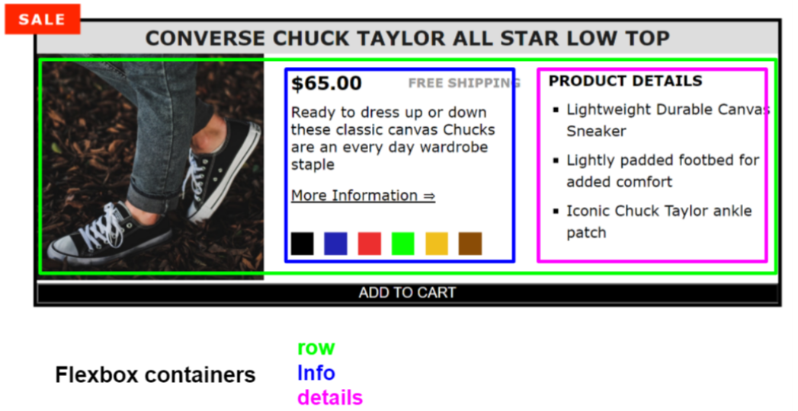
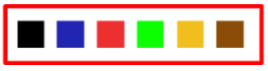
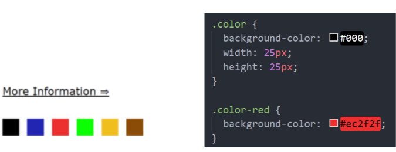

# CMP621A - Converse Challenge Assignment

### This image shows the finished Converse page with component layouts created using flexbox.

### There are some HOVER effects that can be observed in this gif.

### All of the style declarations have been removed from the style.css sheet and placed in the styles_used.txt file. Your assignment is to add them back in to the style.css file.

### ! Do not make any changes to the index.html file !

1. View the index.html to see the different class names. Do not change anything in the index.html file.
2. Copy the correct style declaration from the styles_used.txt file into the style.css file.
   #### ! Some style declarations from styles_used.txt are used more than once in the style.css file!
3. There are hints below to help see where to create the flexbox containers.

## Flexbox Layout Hints

The image below shows suggested flexbox-containers that can be used to create the layout shown.

The green box indicates a flex-container that will contain the 3 basic sections. The first flex-item is simply an image, but the blue and pink boxes indicate 2 additional flex-containers required to group the information in each section. These containers will be added to your html using the `
` element.

In addition to these you should use at least 1 more flex-container to contain the color blocks.

### Styling the Color Blocks

The html shows the `
` elements for the “color-red” class have a parent class called “color”. Properties declared in the .color selector will then be applied to all of the color elements.

